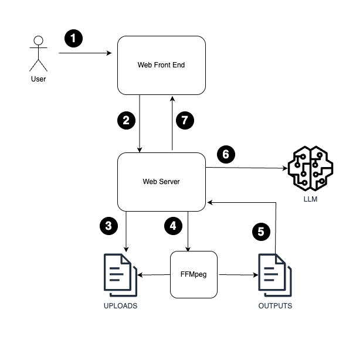
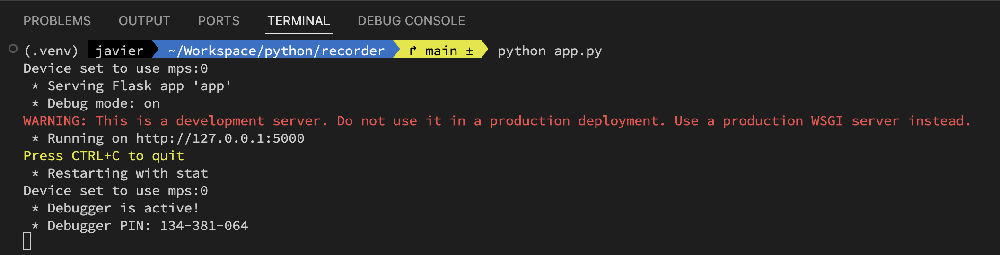
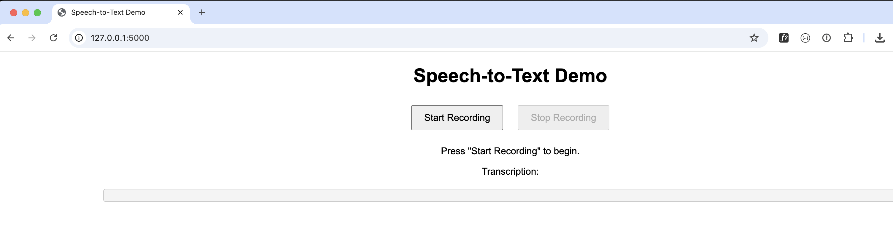

# Transcriber
A simple demo showcasing Automatic Speech Recognition using OpenAI.

## Objective

To evaluate the feasibility of using OpenAI's [whisper_small](https://huggingface.co/openai/whisper-small) model to do Automatic Speech Recognition (ASR) in real-time.

## Workflow

The sequence of steps involved in transcribing speech to text can be summarized below:



1. User uses Web interface to record a voice message.
2. Front-end sends audio recording in `audio/webm` format to web server.
3. The web server saves the file to a temporary location in the file system (uploads).
4. The web server uses FFmpeg to transcode the audio into a `wav` format, saving the result in the outputs directory.
5. The web server reads the transcoded audio and 
6. feeds it to OpenAI's whisper small model for transciption.
7. The web server responds back to the browser with the transcribed text.

## Set up

### Pre-requisites

You will need to have the following software installed on your machine:
- Python 3
- FFmpeg

### Installation

```
make install
```

The first time you run the webserver will take a while, as it will download the LLM from Huggingface.

## Run 

To launch the web sever:

```
python app.py
```
If all goes well, you should see something along these lines:



Pointing your browser to http://127.0.0.1:5000, should bring up the front-end:

